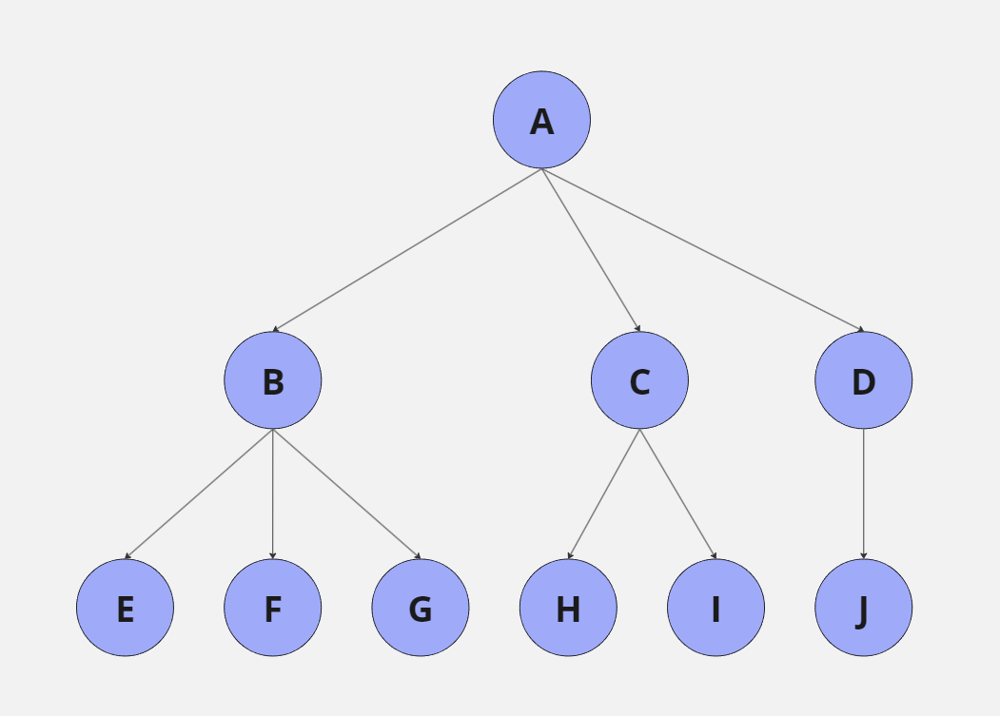
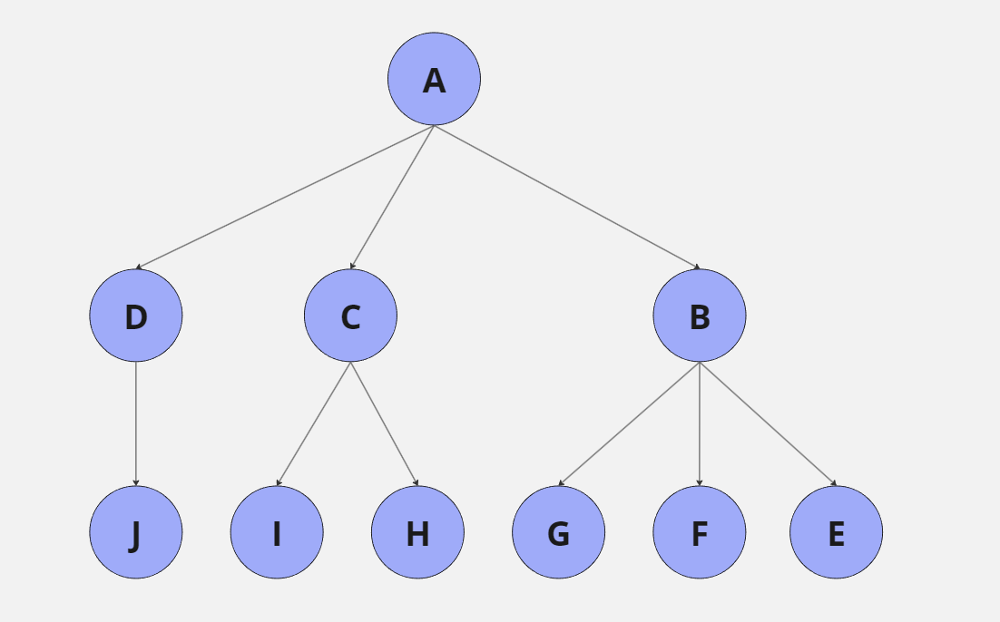

# EJERCICIOS DE EXAMEN

## ÁRBOLES

### [2020] Parcial 1 - Proposición

```cpp

```

### [2021] Parcial 1 - Blanco y negro

```cpp

```

### [2022] SEPTIEMBRE 2022 - esAVL

Construye una función que, dado un Árbol Binario, devuelva true si es un AVL y false en el caso contrario.
*Nota: definir tipos de datos y prototipos de las operaciones de los TADs usados.

```cpp
template <typename T>
bool esAbb(const Abin<T>& A){
    return esAbb_rec(A, A.raiz());
}

template <typename T>
bool esAbb_rec(const Abin<T>& A, const typename Abin<T>::nodo& n){
    if(n == Abin<T>::NODO_NULO){
        return true;
    }
    else{
        if(A.hijoIzqdo(n) != Abin<T>::NODO_NULO && A.hijoDrcho(n) != Abin<T>::NODO_NULO){
            if(A.elemento(A.hijoIzqdo(n)) < A.elemento(n) && A.elemento(A.hijoDrch(n)) > A.elemento(n))
                return esAbb_rec(A, A.hijoIzqdo(n)) && esAbb_rec(A, A.hijoDrcho(n));
            else
                return false;
        }
        else{
            return esAbb_rec(A, A.hijoIzqdo(n)) && esAbb_rec(A, A.hijoDrcho(n));
        }
    }
}

template <typename T>
int alturaArbol_rec(const Abin<T> A, const typename Abin<T>::nodo n){
    if(n == Abin<T>::NODO_NULO)
        return -1;
    else
        return 1 + std::max(alturaArbol_rec(A, A.hijoIzqdo(n)), alturaArbol_rec(A, A.hijoDrcho(n)));
}

template <typename T>
int desequilibrioAbin_rec(Abin<T> A, typename Abin<T>::nodo n){
    if(n == Abin<T>::NODO_NULO)
        return 0;
    else // Devolve el maximo desequilibrio (entre el actual, hizq, hder)
        return  std::max(std::abs(A.altura(A.hijoIzqdo(n)) - A.altura(A.hijoDrcho(n))),
                         std::max(desequilibrioAbin_rec(A, A.hijoIzqdo(n)), desequilibrioAbin_rec(A, A.hijoDrcho(n))));
}

template <typename T>
int desequilibrioAbin(Abin<T> A){
    return desequilibrioAbin_rec(A, A.raiz());
}

template <typename T>
bool esAvl(const Abin<T>& A){
    return esAbb(A) && desequilibrioAbin(A) <= 1;
}
```

### Parcial 1 - Agenda

Haz una agenda usando un Arbol de búsqueda. Utiliza como estructura una con los campos telefono y nombre por ejemplo y acuerdate de sobrecargar los operandos de comparación de la estructura

```cpp

```

### Parcial 1 - Contar descendientes

Dado un árbol binario, cuenta el número de nodos que tienen cuatro descendientes o más.

```cpp
// Devuelve los descendientes de un nodo
template <typename T>
int contarDescendientes(const Abin<T>& A, const typename Abin<T>::nodo& n){
     if(n == Abin<T>::NODO_NULO)
        return 0;
    else
        return 1 + contarDescendientes_rec(A.hijoIzqdo(n)) + contarDescendientes_rec(A.hijoDrcho(n));
}

// Devuelve los nodos que cumplen la condicion
template <typename T>
int nodosCuatro_rec(const Abin<T>& A, const typename Abin<T>::nodo& n){
    if(n == Abin<T>::NODO_NULO){
        return 0;
    }
    else{
        if(contarDescendientes(A, n) >= 4){
            return 1 + nodosCuatro_rec(A.hijoIzqdo(n)) + nodosCuatro_rec(A.hijoDercho(n));
        }
        else{
            return 0;
        }
    }
}

// Llamada a funcion recursiva
template <typename T>
int nodosCuatro(const Abin<T>& A){
    return nodosCuatro_rec(A, A.raiz());
}
```

### Parcial 1 - Nodos con 3 nietos

Implementa una función que devuelva el numero de nodos de un arbol binario que tienen tres nietos

```cpp
template <typename T>
int nodos3nietos(const Abin<T>& A, const typename Abin<T>::nodo& n){
    if(n != Abin<T>::NODO_NULO){
        int numNietos = 0;
        typename Abin<T>::nodo  hIzqdo = A.hijoIzqdo(n),
                                hDrcho = A.hijoDrcho(n);

        if(hIzqdo != Abin<T>::NODO_NULO){
            if(A.hijoIzqdo(hIzqdo) != Abin<T>::NODO_NULO) numNietos++;
            if(A.hijoIzqdo(hDrcho) != Abin<T>::NODO_NULO) numNietos++;
        }
        if(hDrcho != Abin<T>::NODO_NULO){
            if(A.hijoDrcho(hIzqdo) != Abin<T>::NODO_NULO) numNietos++;
            if(A.hijoIzqdo(hDrcho) != Abin<T>::NODO_NULO) numNietos++;
        }
        if(numNietos == 3)
            return 1 + nodos3nietos(A, hIzqdo) + nodos3nietos(A, hDrcho);
        else 
            return nodos3nietos(A, hIzqdo) + nodos3nietos(A, hDrcho);
    }
}
```

### Parcial 1 24 - Inverso Agen





```cpp

```

## GRAFOS
