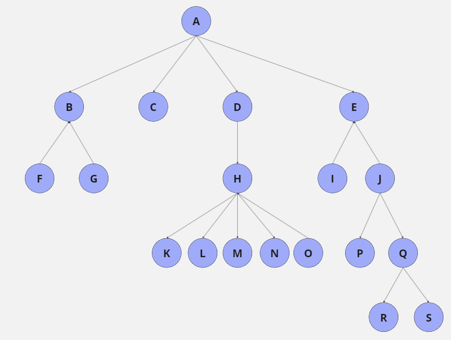
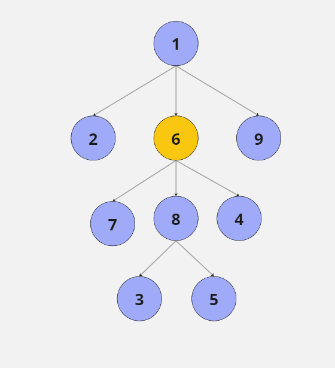

# Práctica 3: Árboles Generales

## ÁRBOLES PARA EJERCICIOS

Los ficheros .dat contienen unos árboles de ejemplo para probar los ejercicios sin necesidad de introducir un árbol manualmente, se leen gracias al fichero agen_E-S.h.
A continuación se muestra una imagen que representa los árboles guardados en cada fichero.

### AgenA.dat



### AgenB.dat

Se usa para podar el árbol desde el nodo con el elemento 6 marcado en naranja.



## EJERCICIOS

### Ejercicio 1

Implementa un subprograma que dado un árbol general nos calcule su grado.

```cpp
template <typename T>
int grado_rec(const Agen<T>& A, typename Agen<T>::nodo n){
    if(n == Agen<T>::NODO_NULO)
        return 0;
    else{
        typename Agen<T>::nodo hijo = A.hijoIzqdo(n); // Primero hijo izquierdo, si es nulo no tiene hijos
        int nHijos = 0, grado = 0;
        while(hijo != Agen<T>::NODO_NULO){ 
            grado = std::max(grado, grado_rec(A, A.hermDrcho(hijo), grado)); // LLamada al hermano y cojo el mayor
            nHijos++; // Sumar el grado del nodo actual
            hijo = A.hermDrcho(hijo); // Avanzar bucle (Pasar hermano)
        }
        return std::max(grado, nHijos);
    }
}

template <typename T>
int gradoAgen(const Agen<T>& A){
    return grado_rec(A, A.raiz());
}
```

### Ejercicio 2

Implementa un subprograma que dados un árbol y un nodo dentro de dicho árbol determine la profundidad de éste nodo en el árbol.

```cpp
template <typename T>
int profundidadNodo(const Agen<T>& A, typename Agen<T>::nodo n){
    if(Agen<T>::NODO_NULO == n) 
        return -1;
    else
        return 1 + profundidadNodo(A, A.padre(n));
}
```

### Ejercicio 3

Se define el desequilibrio de un árbol general como la máxima diferencia entre las alturas de los subárboles más bajo y más alto de cada nivel. Implementa un subprograma que calcule el grado de desequilibrio de un árbol general.

```cpp

```

### Ejercicio 4

Dado un árbol general de enteros A y un entero x, implementa un subprograma que realice la poda de A a partir de x. Se asume que no hay elementos repetidos en A.

```cpp

```
