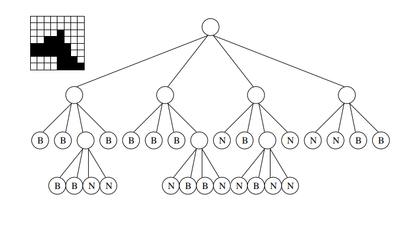

# Práctica 5: Árboles Parcialmente Ordenados

## ÁRBOLES PARA EJERCICIOS

Los ficheros .dat contienen unos árboles de ejemplo para probar los ejercicios sin necesidad de introducir un árbol manualmente, se leen gracias al fichero apo_E-S.h.
A continuación se muestra una imagen que representa los árboles guardados en cada fichero.

### AbbA.dat


### AbbB.dat


## EJERCICIOS

### Ejercicio 1

Dado un árbol binario de enteros donde el valor de cada nodo es menor que el de sus hijos, implementa un subprograma para eliminar un valor del mismo preservando la propiedad de orden establecida. Explica razonadamente la elección de la estructura de datos.

Nota: Se supone que en el árbol no hay elementos repetidos, y que el número de nodos del mismo no está acotado.

```cpp

template <typename T>
typename Abin<T>::nodo buscarNodo(Abin<T>& A, const typename Abin<T>::nodo n, const T& elto){
    if(n != Abin<T>::NODO_NULO){
        if(A.elemento(n) != elto){
            typename Abin<T>::nodo resultado = buscarNodo(A.hijoIzqdo(n)); // Busqueda por hijo izquierdo
            if(resultado != Abin<T>::NODO_NULO) // Encontado en hijo izquierdo
                return resultado;
            resultado = buscarNodo(A.hijoDrcho(n)); // Busqueda en hijo derecho
            if(resultado != Abin<T>::NODO_NULO) // Encontrado en hijo derecho
                return resultado;
        } 
        else {
            return n;
        }
    }
    else {
        return Abin<T>::NODO_NULO;
    }

}

template <typename T>
void eliminarValor(Abin<T>& A, const T& valor){
    typename Abin<T>::nodo n, hIzq, hDer;

    actual = buscarNodo(A, A.raiz(), valor);
    hIzq = A.hijoIzqdo(actual);
    hDer = A.hijoDrcho(actual);

    while(hIzq != Abin<T>::NODO_NULO || hDer != Abin<T>::NODO_NULO){ // Mientra no sea nodo hoja
        typename Abin<T>::nodo candidato;
        if(hIzq != Abin<T>::NODO_NULO && hDer != Abin<T>::NODO_NULO){
            if(A.elemento(hIzq) > A.elemento(hDer))
                candidato = hIzq;
            else
                candidato = hDer;
        }
        else if(hIzq != Abin<T>::NODO_NULO){
            candidato = hIzq;
        }
        else{
            candidato = hDer;
        }
        
        A.elemento(actual) = candidato.elemento(candidato);

        actual = candidato;
        hIzq = A.hijoIzqdo(actual);
        hDer = A.hijoDrcho(actual);
    }

    if(actual == A.raiz()) // Actual es raiz
        A.eliminarRaiz();
    else if(A.hijoIzqdo(A.padre(actual)) == actual) // Actual es el hijo izquiero
        A.eliminarHijoIzqdo(A.padre(actual));
    else // Actual es hijo derecho
        A.eliminarHijoDrcho(A.padre(actual));
}
```

### Ejercicio 2

Un montículo min-max tiene una estructura similar a la de un montículo ordinario (árbol parcialmente ordenado), pero la ordenación parcial consiste en que los elementos que se encuentran en un nivel par (0, 2, 4,...) son menores o iguales que sus elementos descendientes, mientras que los elementos que se encuentran en un nivel impar (1, 3, 5,...) son mayores o iguales que sus descendientes. Esto quiere decir que para cualquier
elemento e de un nivel par se cumple abuelo ≤ e ≤ padre y para cualquier elemento e de un nivel impar padre ≤ e ≤ abuelo.

Implementa una operación de orden logarítmico para añadir un elemento a un
montículo min-max almacenado en un vector de posiciones relativas.

```cpp

```

### Ejercicio 3

Implementa una operación de orden logarítmico para eliminar el elemento máximo de un montículo min-max definido como en el problema anterior.

```cpp

```

### Ejercicio 4

Un árbol es estrictamente ternario si todos sus nodos son hojas o tienen tres hijos. Escribe una función que, dado un árbol de grado arbitrario, nos indique si es o no estrictamente ternario.

```cpp
template <typename T>
bool esTernario(const Agen<T>& A, const typename Agen<T>::nodo n){
    if(n == Agen<T>::NODO_NULO){
        return true;
    }
    else {
        typename Agen<T>::nodo hijo = A.hijoIzqdo(n);
        int numhijos = 0;
        bool ternario = true;
        while(hijo = Agen<T>::NODO_NULO && numhijos > 3){
            ternario = ternario || esTernario(A, A.hijoIzqdo(hijo)) && esTernario(A, A.hijoDrcho(hijo));
            numHijos++;
            hijo = A.hermDrcho(hijo);
        }
        return numHijos == 0 || numHijos == 3 && ternario;
    }
}
```

### Ejercicio 5

Una forma de representar una figura plana en blanco y negro consiste en utilizar un árbol cuaternario en el que cada nodo o tiene exactamente cuatro hijos, o bien es una hoja. Un nodo hoja puede ser blanco o negro y un nodo interno no tiene color.
Una figura dibujada dentro de un cuadrado de lado 2^k
 se representa de la forma siguiente: Se divide el cuadrado en cuatro cuadrantes y cada uno se representa como un hijo del nodo raíz. Si un cuadrante está completamente negro corresponde a una hoja negra; si, por el contrario, el cuadrante está completamente blanco, éste corresponde a
una hoja blanca; y si un cuadrante está parcialmente ocupado por negro y blanco, entonces corresponde a un nodo interno del árbol y este cuadrante se representa siguiendo el mismo método subdividiéndolo en otros cuatro cuadrantes. Como ejemplo se muestra una figura en blanco y negro y su árbol asociado, tomando los cuadrantes en el sentido de las agujas del reloj a partir del cuadrante superior izquierdo.



Implementa una función que dado un árbol de esta clase, con k+1 niveles,
devuelva la figura asociada, representada como una matriz cuadrada de tamaño 2^k en la que cada celda representa un punto blanco o negro.

Nota: Por simplificar el problema, se asume que en cada nodo del árbol se
incluyen las coordenadas de la esquina superior izquierda y de la esquina inferior derecha del cuadrante que representa.

```cpp

```

## APO Especificación

### Definición

Un árbol parcialmente ordenado (o montículo) es un árbol completo en el que el valor de cualquier nodo es menor o igual que el de todos sus descendientes. Por tanto, para todo nodo x de un APO el valor en el padre de x es menor o igual que el valor en x (con excepción de la raíz, que no tiene padre).

### Operaciones
